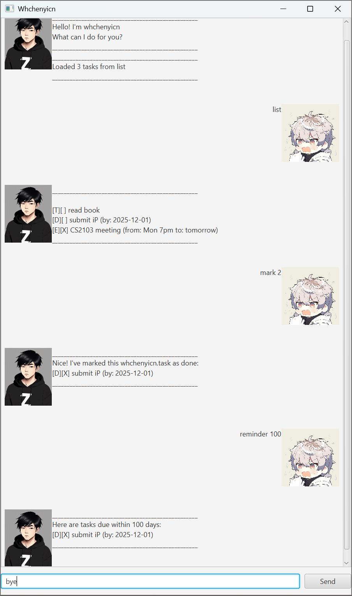

# Whchenyicn User Guide

// Update the title above to match the actual product name

// Product screenshot goes here

// Product intro goes here
Whchenyicn is a simple task management chatbot with a GUI.  
It helps you keep track of todos, deadlines, and events, and comes with reminders and search features.  
It runs on Java 17 and stores your tasks automatically between sessions.

---

## Adding todos

Adds a simple task with just a description.

**Example:**
todo read book
**Expected outcome:**
Got it. I've added this task:
[T][ ] read book
Now you have 1 tasks in the list.

## Adding deadlines

// Describe the action and its outcome.
Adds a task with a description and a deadline.
// Give examples of usage

Example: `deadline return book /by 2025-09-30`

// A description of the expected outcome goes here
**Expected outcome:**
Got it. I've added this task:
[D][ ] return book (by: 2025-09-30)
Now you have 2 tasks in the list.
```
expected output
```

## Adding events

Adds a task with a description and an event time.

**Example:**

event project meeting /at Monday 2pm

**Expected outcome:**

Got it. I've added this task:
[E][ ] project meeting (at: Monday 2pm)
Now you have 3 tasks in the list.

---

## Listing tasks

Shows all tasks currently in your list.

**Example:**

**Expected outcome:**

1.[T][ ] read book
2.[D][ ] return book (by: 2025-09-30)
3.[E][ ] project meeting (at: Monday 2pm)

## Marking and unmarking tasks

Marks or unmarks a task in the list by its number.

**Examples:**

mark 2
unmark 2

**Expected outcomes:**

Nice! I've marked this task as done:
[D][X] return book (by: 2025-09-30)

OK, I've marked this task as not done yet:
[D][ ] return book (by: 2025-09-30)

## Deleting tasks

Removes a task from the list by its number.

**Example:**
delete 1

**Expected outcome:**

This task has been removed
[T][ ] read book
2 tasks left in the list.

## Finding tasks

Finds tasks that contain a given keyword.

**Example:**

**Expected outcome:**

Here are the matching tasks in your list:
1.[D][ ] return book (by: 2025-09-30)

## Reminders

Shows tasks due within the given number of days.

**Example:**

**Expected outcome:**

Here are tasks due within 7 days:
[D][ ] return book (by: 2025-09-30)

## Exiting

Closes the chatbot.

**Example:**

bye

**Expected outcome:**

Bye! Hope to see you again soon!

## Error Handling

- If you enter an unknown command (e.g., `blah`), Whchenyicn shows a clear error message in the chat window.
- If the save file is missing, Whchenyicn automatically creates a new one instead of crashing.
